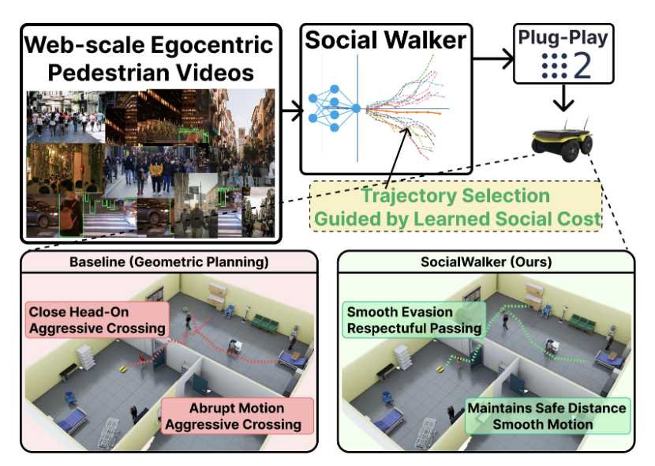

# SocialWalker: Learning a Social Compliance Cost from Web-Scale Human Walking Videos for Plug-and-Play Robot Navigation
---


---

The site available at `https://khoadangnguyenn.github.io/SocialNav-Webpage/`.

---

## 📁 Repository Structure

```
SocialNav-Webpage/
├── index.html                  # Main webpage containing the paper's content
├── README.md                   # This file
└── static/
    ├── css/
    │   ├── bulma.min.css       # Bulma CSS framework
    │   ├── fontawesome.all.min.css
    │   └── social-nav-vlm.css  # Custom CSS
    ├── js/
    │   └── social-nav-vlm.js   # Custom JavaScript
    ├── images/                 # Project images and figures
    └── video/                  # Demo videos
```
---
## 📝 License

This website template is adapted from [Nerfies](http://nerfies.github.io/), licensed under the [Creative Commons Attribution-ShareAlike 4.0 International License](http://creativecommons.org/licenses/by-sa/4.0/).
